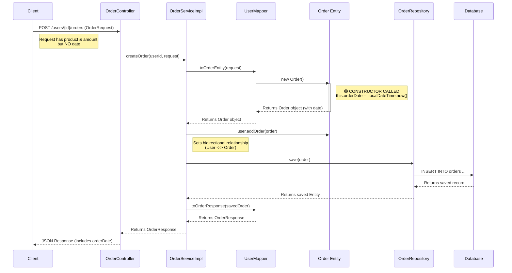

# Order Creation Flow & `orderDate` Initialization

This document details the lifecycle of an Order creation request, specifically highlighting how and when the `orderDate` field is populated.

## 🔄 Sequence Diagram



## 📝 Step-by-Step Explanation

### 1. The Request
The client sends a JSON payload to `OrderController`.
```json
{
  "product": "Laptop",
  "amount": 1200.50
}
```
*Notice: No date is sent by the user.*

### 2. The Mapper (`UserMapper`)
The service calls `userMapper.toOrderEntity(request)`.
*   **Configuration**: `@Mapping(target = "orderDate", ignore = true)`
*   **Action**: MapStruct ignores the date field from the request (which doesn't exist anyway) and instantiates the `Order` class.

### 3. The Constructor (CRITICAL STEP) 🟢
When MapStruct calls `new Order()`, the constructor logic executes:
```java
public Order() {
    // This line runs immediately upon object creation
    this.orderDate = LocalDateTime.now(); 
}
```
*   **Result**: The `orderDate` field is now populated with the current server timestamp (e.g., `2025-12-01T22:15:00`).

### 4. Relationship Handling
The service links the order to the user:
```java
user.addOrder(order);
```
This ensures the `user_id` foreign key will be set correctly.

### 5. Persistence
The repository saves the order to the database.
*   **SQL**: `INSERT INTO orders (amount, order_date, product, user_id) VALUES (...)`
*   The `order_date` column in the DB is now populated.

### 6. The Response
The saved entity (which definitely has the date) is converted back to a response DTO.
```json
{
  "id": 1,
  "product": "Laptop",
  "amount": 1200.50,
  "orderDate": "2025-12-01T22:15:00",
  "userId": 1,
  "userName": "Alice"
}
```
